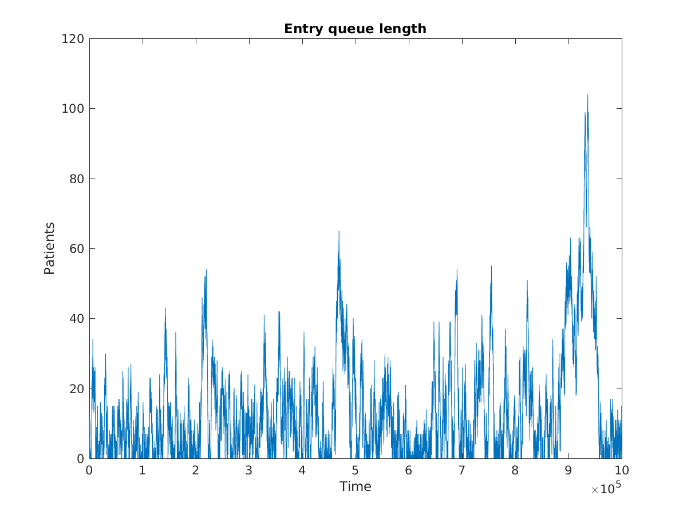
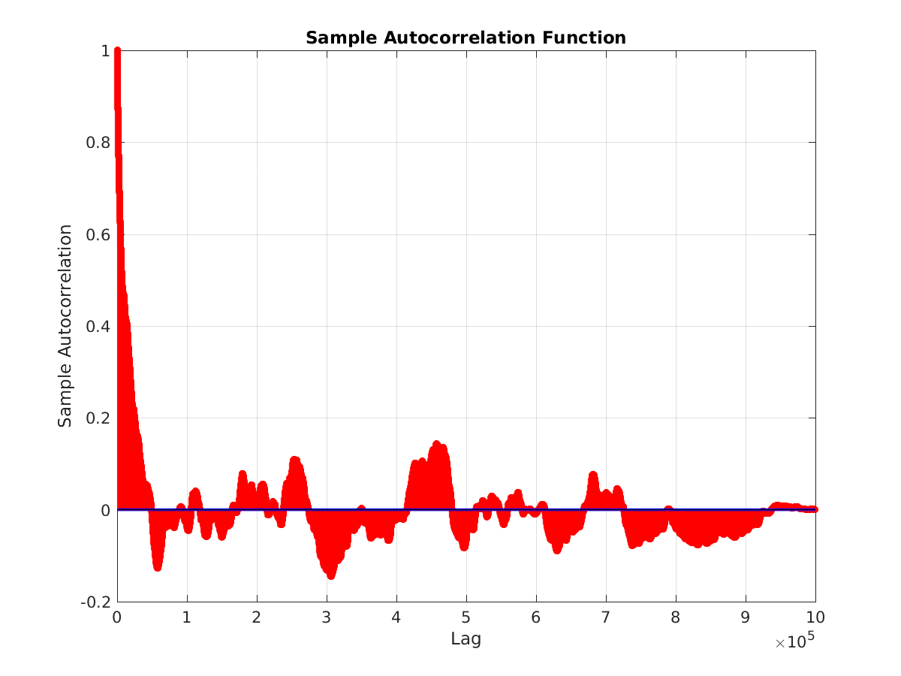
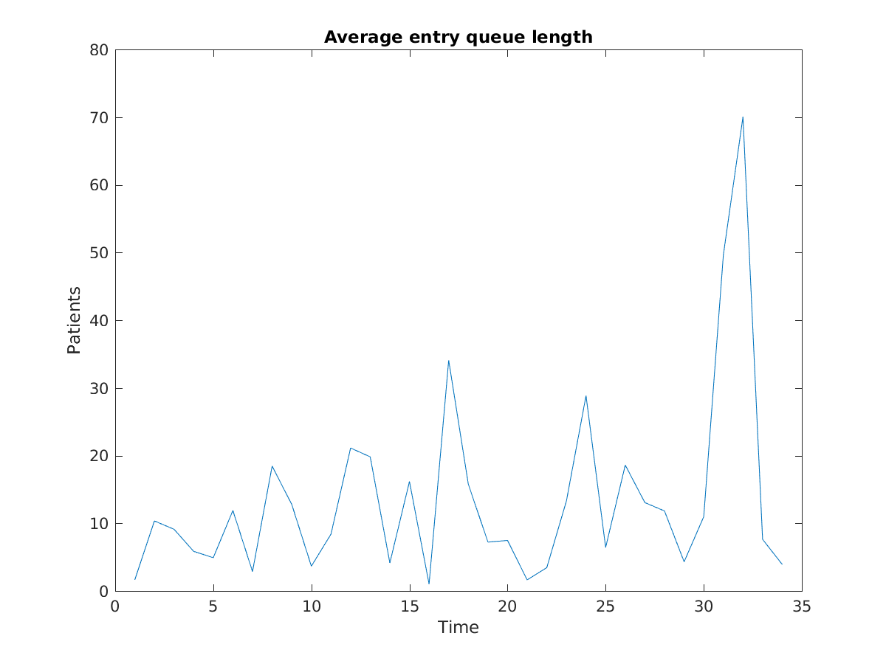
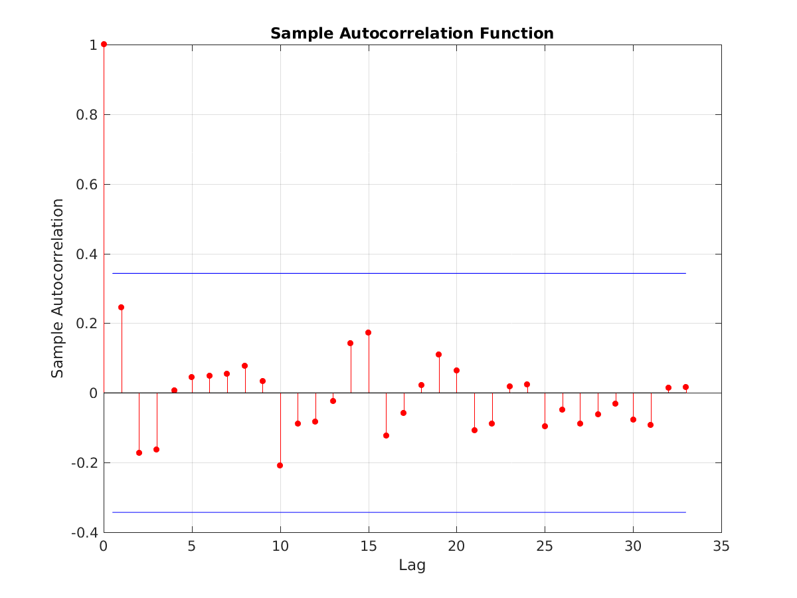

# Ex 4.2

Using the design from ex. 4.1, We ran a simulation for 1e6 time units and gathered the length of the entry queue at each time step of the simulation. We then used MATLAB (see [the code](analysis.m)) to calculate sample autocorrelation and to test different sampling parameters.

### Full time series

The original time series of a million measurement has clear autocorrelation on time scales up to 40000 time units:

### Simulated simulation reporting

Picking otherwise reasonable parameters for the data gathering rate and averaging period, we gradually increased the sampling interval until the autocorrelation between successive samples decreased to a tolerable level. For a data gathering rate of 10 time units and a averaging time (sample length) of 1000 time units, we found that a sampling interval of 3000 time units was needed to reduce the autocorrelation below 0.3.

